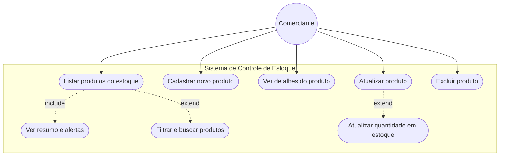
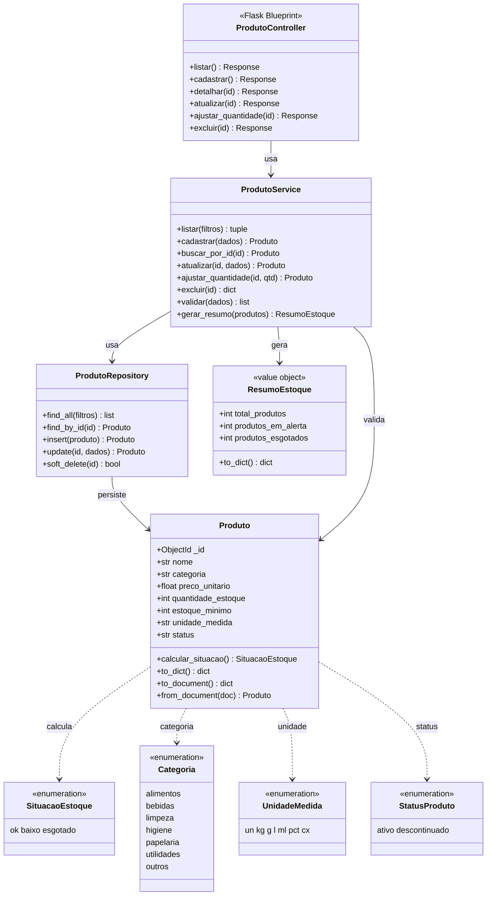

# Sistema de Controle de Estoque — Unicarioca

SPA desenvolvida como **Projeto de Extensão em Web Back-End** do Centro Universitário Carioca (Unicarioca). A solução é voltada a **micro e pequenos comerciantes (MPEs)** que precisam gerenciar produtos, monitorar quantidades em estoque e identificar itens que exigem reposição.

## Sobre o projeto

O sistema permite cadastrar produtos com informações como nome, categoria, preço, quantidade atual e estoque mínimo. O backend calcula automaticamente a situação de cada item:

| Situação   | Condição                                      |
|------------|-----------------------------------------------|
| `ok`       | quantidade acima do estoque mínimo            |
| `baixo`    | quantidade menor ou igual ao estoque mínimo   |
| `esgotado` | quantidade igual a zero                         |

A exclusão de produtos é feita por **exclusão lógica**, preservando o histórico no banco de dados.

## Tecnologias

| Camada         | Tecnologia                          |
|----------------|-------------------------------------|
| Frontend       | React.js, Axios, HTML, CSS          |
| Backend        | Python, Flask, Flask-CORS           |
| Banco de dados | MongoDB                             |
| Infraestrutura | Docker, Docker Compose              |
| Testes         | unittest (biblioteca padrão Python) |

## Arquitetura

O backend segue organização em camadas:

```
Controller → Service → Repository → MongoDB
```

- **Controller:** rotas HTTP (Blueprint Flask)
- **Service:** regras de negócio e validações
- **Repository:** persistência e consultas
- **Domain:** entidade `Produto`, enums e value objects

Injeção de dependência é feita no `app.py` (composition root).

## Diagramas UML

### Diagrama de caso de uso

Ator: **Comerciante**. Relacionamentos `include` e `extend` conforme definido na Etapa 2.



### Diagrama de classes

Domínio, value objects, enums e camadas do backend Flask.



## Estrutura do repositório

```
projeto-academico-unicarioca/
├── backend/
│   ├── app.py                 # ponto de entrada da API
│   ├── controllers/           # rotas HTTP
│   ├── services/              # regras de negócio
│   ├── repositories/          # acesso ao MongoDB
│   ├── domain/                # entidades e enums
│   ├── dtos/                  # tradução HTTP ↔ domínio
│   ├── migrations/            # versionamento do banco
│   ├── tests/                 # testes unitários
│   └── requirements.txt
├── frontend/
│   ├── src/
│   │   ├── App.js             # SPA principal
│   │   ├── App.css
│   │   └── api.js             # cliente Axios
│   └── package.json
├── docs/
│   └── ENTREGA_ETAPA3.html    # modelo de entrega (PDF)
└── docker-compose.yml
```

## Pré-requisitos

- [Docker](https://www.docker.com/) e Docker Compose instalados

## Como executar

### Primeira execução (ou após alterar dependências)

```bash
docker compose up -d --build
```

### Execução no dia a dia (desenvolvimento)

Com os volumes configurados para hot-reload, basta:

```bash
docker compose up -d
```

Use `--build` novamente apenas se houver mudanças em `Dockerfile`, `requirements.txt` ou `package.json`.

### Migrations do banco

Após subir os containers pela primeira vez:

```bash
docker exec unicarioca_backend python migrate.py
```

### Testes unitários (backend)

```bash
docker exec -w /app unicarioca_backend python -m unittest discover -s tests -t /app -v
```

## Acessos

| Serviço        | URL                          |
|----------------|------------------------------|
| Frontend (SPA) | http://localhost:3000        |
| API (Backend)  | http://localhost:5000        |
| Mongo Express  | http://localhost:8081        |

## API REST — Produtos

| Método | Rota                          | Descrição                    |
|--------|-------------------------------|------------------------------|
| GET    | `/produtos`                   | Listar (filtros + resumo)    |
| GET    | `/produtos/<id>`              | Detalhar produto             |
| POST   | `/produtos`                   | Cadastrar produto            |
| PUT    | `/produtos/<id>`              | Atualizar produto            |
| PATCH  | `/produtos/<id>/quantidade`   | Ajuste rápido de quantidade  |
| DELETE | `/produtos/<id>`              | Excluir (exclusão lógica)    |

**Filtros disponíveis em `GET /produtos`:** `?categoria=`, `?status=`, `?busca=`

**Exemplo de resposta da listagem:**

```json
{
  "produtos": [
    {
      "id": "...",
      "nome": "Arroz Branco 5kg",
      "categoria": "alimentos",
      "quantidade_estoque": 40,
      "estoque_minimo": 10,
      "situacao": "ok"
    }
  ],
  "resumo": {
    "total_produtos": 3,
    "produtos_em_alerta": 1,
    "produtos_esgotados": 1
  }
}
```

## Funcionalidades da SPA

- Cadastro, edição e exclusão de produtos
- Listagem com situação visual (ok / baixo / esgotado)
- Painel de resumo com totais e alertas
- Filtros dinâmicos por categoria e busca por nome
- Ajuste rápido de quantidade (+ / −)
- Menu de navegação entre seções

## Encerrar a aplicação

```bash
docker compose down
```

Para remover também o volume de dados do MongoDB:

```bash
docker compose down -v
```

## Contexto acadêmico

Projeto desenvolvido na disciplina **Projeto de Extensão em Web Back-End** (Unicarioca), como culminância da **Etapa 3 — Produto Final**, com customização conforme regras de negócio definidas na Etapa 2 (Plano de Ação em Prática).
